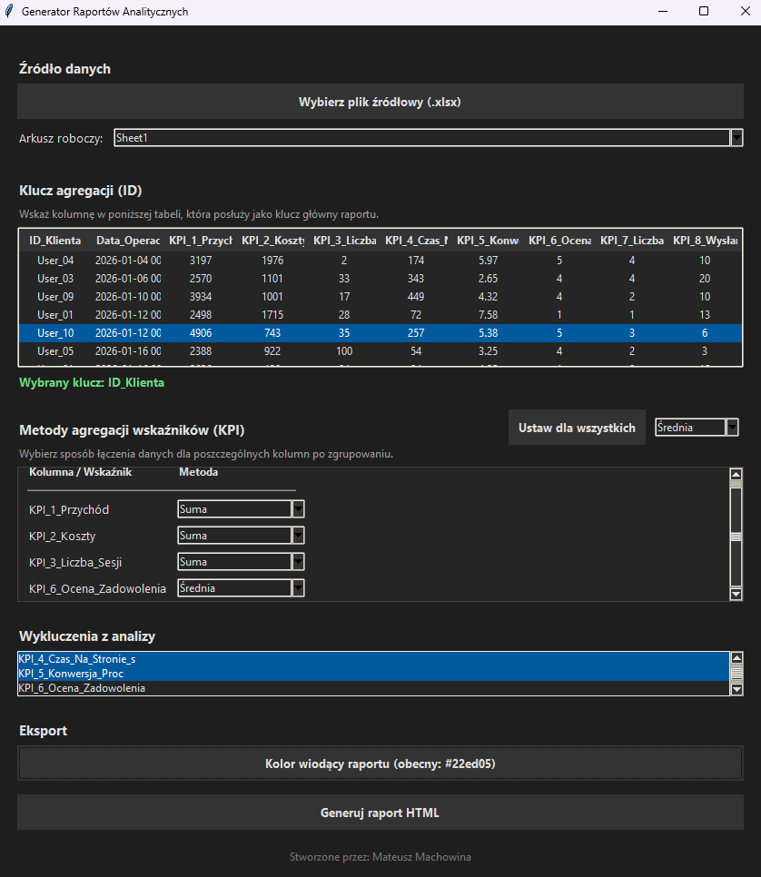
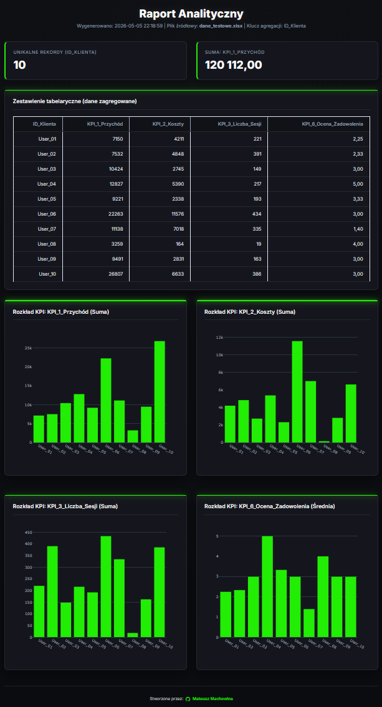

#   HTML Dashboard Generator

A modern desktop application (GUI) for transforming raw Excel data into interactive, professional HTML reports.

## ✨ Key Features
- **Data Import:** Supports `.xlsx` and `.xls` files with sheet selection.
- **Data Aggregation:** Group records by a chosen ID and define aggregation methods (`Sum`, `Average`, `Min`, `Max`) per column.
- **Smart Filtering:** Automatic detection of date columns and manual exclusion of unnecessary data.
- **Custom Branding:** Integrated color picker to set the report's primary accent color (default `#007ACC` - professional blue).
- **Interactive Visuals:** Responsive Plotly bar charts and summary scorecards.
- **Dark Mode UI:** Professional, dark-themed interface built with customized Tkinter styles.

## 🚀 Quick Start

### Requirements
Ensure you have **Python 3.14** and the necessary libraries:
```bash
pip install pandas plotly openpyxl
```

## Running the App

1. Save the script as main.py.
2. Run the command:
```bash
python main.py
```

## 🛠 Usage
1. **Load Data:** Click "Wybierz plik źródłowy" and select your Excel file.
2. **Set Key:** Click on a **column header** in the preview table to set it as the aggregation ID.
3. **Configure KPI:**
   - Select columns to ignore in the "Wykluczenia" list.
   - Choose aggregation methods for numeric columns.
4. **Generate:** Click "Generuj raport HTML". The report will open automatically in your browser.

## 📦 Tech Stack
- **GUI:** Tkinter
- **Data Engine:** Pandas
- **Charts:** Plotly
- **Output:** HTML5 / CSS3 (Inter font, responsive layout)
  
## 🖥️ Main Interface


## 📊 Generated Report

