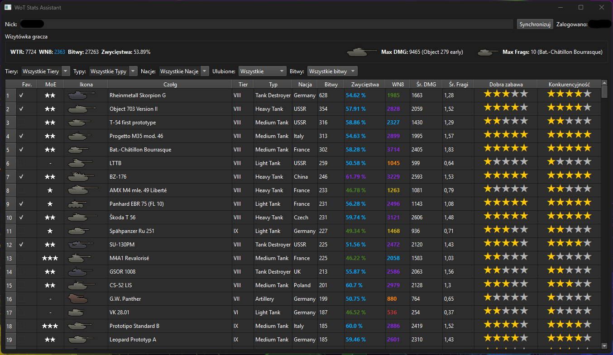

# 🎮 WoT Assistant Pro

An advanced, interactive graphical Python application (GUI) to explore player stats, track tank performance, and calculate **WN8** in real-time using Wargaming and XVM APIs.

## 🎯 Features

- 🔍 Search for World of Tanks players by username
- 📊 View **WTR**, **global WN8**, **win rate**, and **total battles** at a glance
- 📈 Real-time **WN8 calculation** for individual tanks based on current XVM Expected Values
- 🎚️ Advanced filtering by **Tier**, **Type**, **Nation**, **Favorites**, and **Minimum Battles** (e.g., 20 or 50+)
- ⭐ Personal rating system: Rate your tanks for **Fun** and **Competitiveness** (1-5 stars)
- 🏅 Track **Marks of Excellence (MoE)** directly in the app with a simple click
- ⚡ Blazing fast performance with local **SQLite database** caching and auto-downloaded tank icons
- 🔐 API key management via `.env` file

## 🧪 Requirements

Make sure you have these Python packages installed:

```text
PyQt6
requests
python-dotenv
 ```

## 🛠️ Setup Instructions

1. **Download the following files**:
   - The script file (`wot_assistant.py`)
   - `requirements.txt`

2. **Create a `.env` file** in the same folder and add your API key:

   ```env
   API_KEY=your_api_key_here
   ```

   🔑 Don't have a key yet? Get one here: [Wargaming Developer Portal](https://developers.wargaming.net/)

3. **Open Command Prompt / Terminal**

4. **Navigate to the script folder**:  
   *(If your script is on another drive, switch first by typing the drive letter)*
   
   ```bash
   D:
   cd "D:\Path\To\Your\Script"
   ```

5. **Install required libraries**:

   ```bash
   pip install -r requirements.txt
   ```

6. **Run the app**:

   ```bash
   python wot_assistant.py
   ```

## 💬 Notes

- The initial synchronization may take a bit longer than usual. The app will automatically create a local `wot_stats.db` database and an `icons_cache` folder.
- Designed for the EU region (`api.worldoftanks.eu`); you can adjust the `API_URL` variable in the script for other regions if needed.
- **Privacy Tip:** Never upload your `.env` file or `wot_stats.db` to public repositories (add them to your `.gitignore`!).


